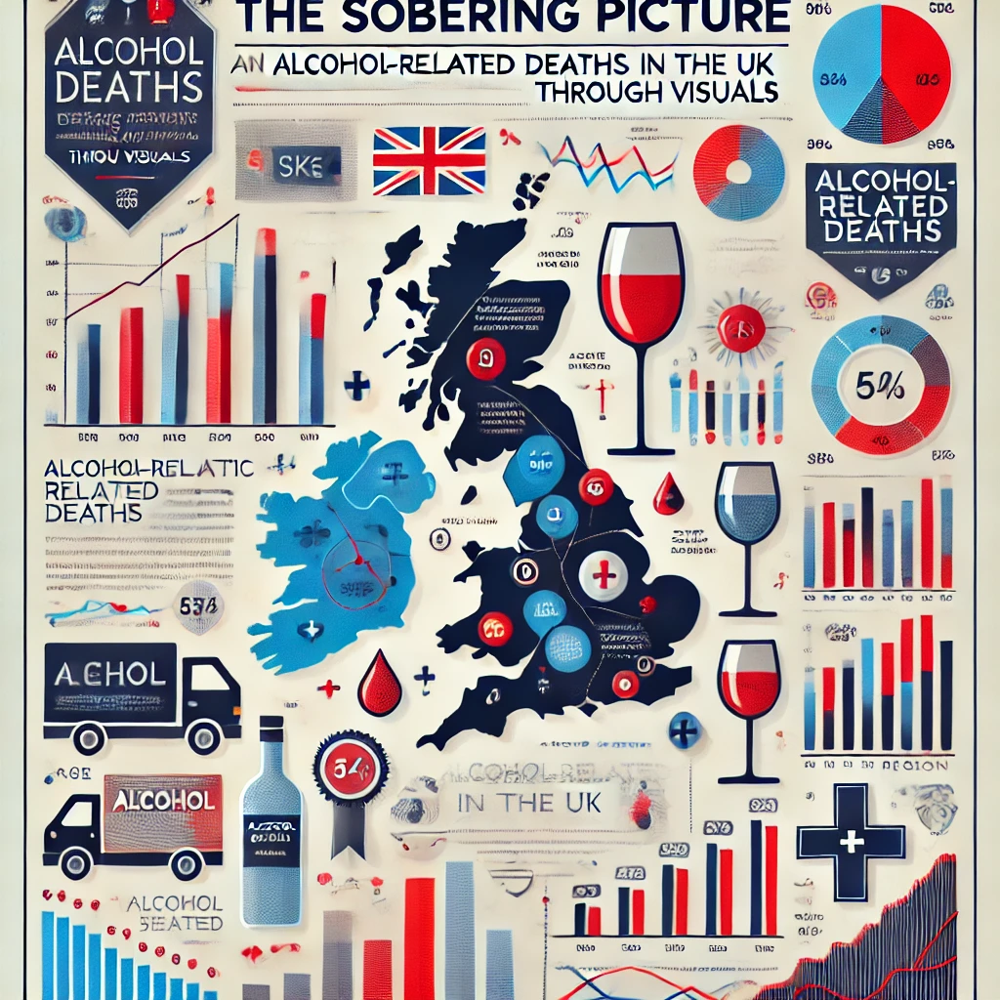
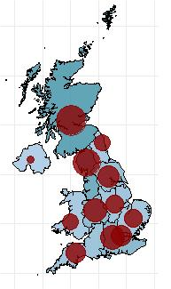
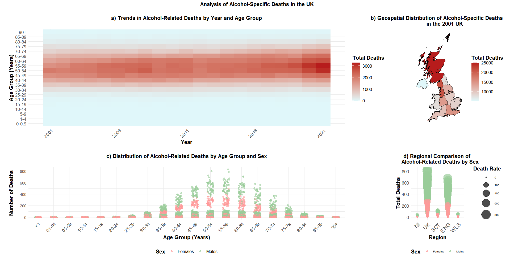
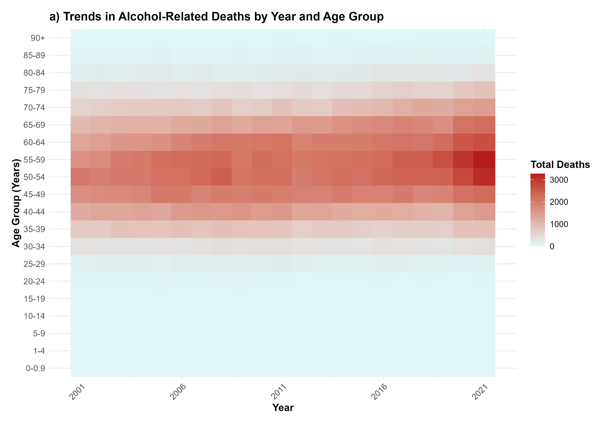
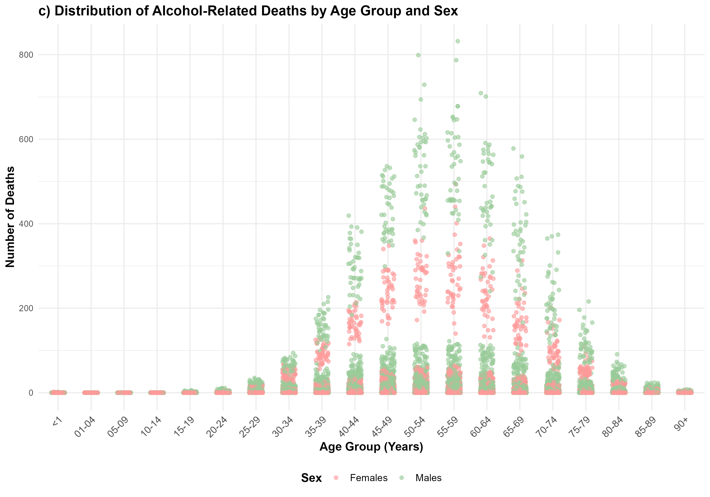
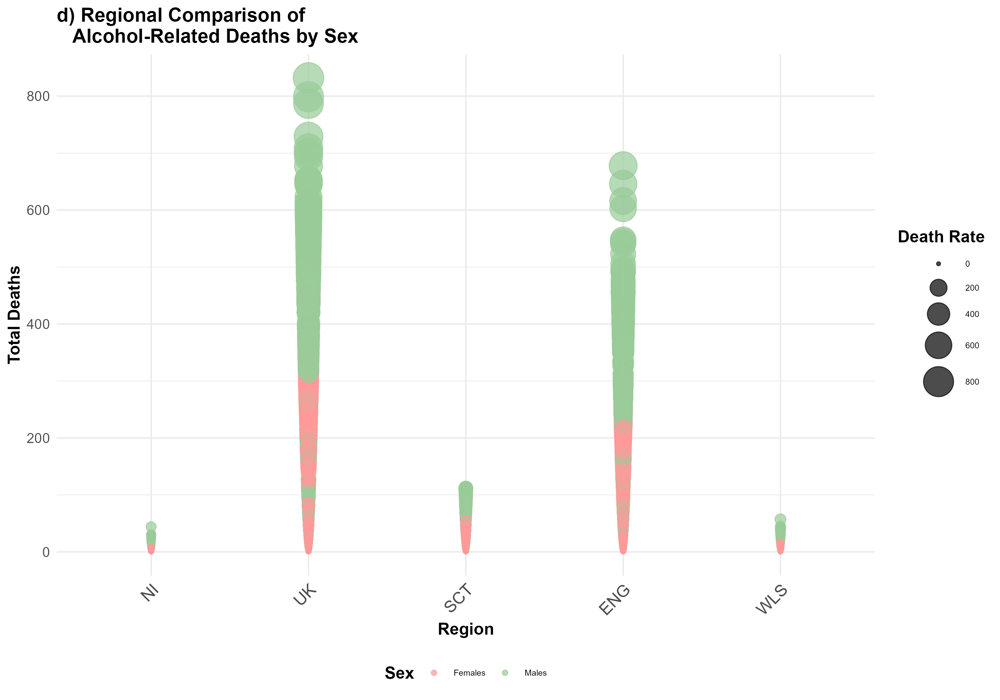

<meta property="og:title" content="The Sobering Picture"/>
<meta property="og:image" content="https://mahesh7667.github.io/Data-Driven-Insights-into-Alcohol-Related-Mortality/meta/visualisation_thumbnail.png"/>
<meta property="og:description" content="The Sobering Picture: Alcohol-Related Deaths in the UK though visuals"/>
<meta property="og:url" content="https://mahesh7667.github.io/Data-Driven-Insights-into-Alcohol-Related-Mortality/Exploring-through-Visualizations"/>
<meta property="og:image:width" content="1200" />
<meta property="og:image:height" content="627"/>
<meta property="og:type" content="website"/> 

  <!-- Newspaper Headline -->
  

    <h1 style="font-family: 'Times New Roman', serif; font-size: 32px; font-weight: bold; margin-bottom: 10px;">📰 The Sobering Picture</h1>
    <h2 style="font-family: 'Times New Roman', serif; font-size: 20px; font-weight: bold; color: gray;">Alcohol-Related Deaths in the UK Reach Concerning Levels 🍷  </h2>
  

  

  

    <!-- Left column for text -->
    

      
 Alcohol-specific deaths refer to fatalities caused solely by alcohol consumption, where alcohol is the direct and underlying cause of death. These deaths are attributed to conditions such as <b>liver cirrhosis, alcohol poisoning, and alcoholic hepatitis</b>, which result from prolonged alcohol misuse or acute alcohol intoxication. In the United Kingdom, alcohol-specific deaths have been rising, making them a critical public health issue. These deaths vary significantly across different demographics (age and sex), geographical regions, and time periods. Identifying these variations can reveal high-risk groups and trends, providing valuable insights for healthcare professionals, policymakers, and public health organizations. 

    

    <!-- Right column for image -->
    

      
      

        <i>🚨 A data-driven snapshot of alcohol-related deaths</i>
      

    

  

  

  
 Understanding alcohol-specific death patterns is essential due to their profound social, economic, and healthcare implications.
  

    <!-- Right column for image -->
    

      
      

        <i>🚨 A data-driven snapshot of alcohol-related deaths</i>
      

    

    <!-- Left column for text -->
    

      

        <b>1. Public Health Significance Rising Death Rates: </b>Alcohol-specific deaths have been increasing, particularly among middle-aged individuals, necessitating urgent public health interventions. <b>2. Economic Burden:</b> Alcohol misuse places a financial strain on healthcare systems due to the high costs of treating alcohol-related conditions. <b>3. Policy and Healthcare Interventions</b> Policymakers need accurate data to implement effective alcohol control policies.
      

    

    

    
By presenting this information through <b>engaging</b> and <b>intuitive visualizations</b>, this project ensures that stakeholders from policymakers to the general public <b>can understand, interpret, and act upon these insights effectively</b>. The ultimate goal is to <b>support data-driven policies and interventions</b> that reduce alcohol-related harm and save lives in the UK. 

  

---

## What This Project Shows

Our visualizations provide key insights into alcohol-specific deaths:
1. **Who is most affected**: Middle-aged males (40–69 years) are disproportionately impacted, making them the most vulnerable demographic.
2. **Where deaths are highest**: Scotland and northern England have the most alcohol-specific deaths, highlighting regional disparities.
3. **How trends have changed**: Deaths have steadily increased over the years, especially from 2015 onward, pointing to an escalating public health crisis.
4. **Differences between regions and sexes**: Males dominate in all regions, but Wales and Northern Ireland show significantly fewer deaths compared to Scotland and England.

These insights offer a comprehensive view of the issue, helping decision-makers prioritize interventions and allocate resources effectively.

---

## Why This Matters
Alcohol-specific deaths are preventable, and understanding the factors contributing to these fatalities is essential for saving lives. By highlighting trends and disparities, this project supports:
- **Targeted Health Campaigns**: Public health initiatives can be tailored to at-risk groups, such as middle-aged males in high-mortality regions.
- **Resource Allocation**: Policymakers can direct funding and resources to regions and populations most affected by alcohol-related harm.
- **Informed Policy Development**: Insights from the data can shape policies like minimum alcohol pricing and expanded addiction recovery programs.

Every life saved represents a win for individuals, families, and communities, reducing the broader societal burden of alcohol-related harm.

---

## Key Visualisations
### 1. **Heatmap**
- **What it shows**: Trends in alcohol-specific deaths across different age groups and years.
- **Key takeaway**: Middle-aged groups (40–69 years) consistently face the highest risk. Death rates have surged in recent years, especially from 2015 onward.
- **Why it matters**: This visualization reveals where interventions are needed most urgently, both in terms of age demographics and time periods. 

### 2. **Geospatial Map**
- **What it shows**: Regional differences in alcohol-specific deaths for the baseline year of 2001.
- **Key takeaway**: Scotland stands out with the highest mortality rates, while Wales and Northern Ireland report significantly fewer deaths.
- **Why it matters**: The map highlights the geographic disparities in alcohol-related harm, supporting region-specific policy responses. 
<iframe src="output/geospatial.html" width="800" height="600"></iframe>
 

### 3. **Scatter Plot**
- **What it shows**: Disparities in alcohol-specific deaths by age group and sex.
- **Key takeaway**: Males dominate across all age groups, with a sharp peak in the 50–59 age range. Females are consistently affected at lower rates.
- **Why it matters**: This visualization underscores the need for gender-specific health interventions and further research into the underlying causes of these disparities. 

### 4. **Bubble Plot**
- **What it shows**: Regional and sex-based differences in alcohol-specific deaths.
- **Key takeaway**: England and Scotland dominate in terms of total deaths, with males disproportionately affected. Wales and Northern Ireland report the fewest deaths.
- **Why it matters**: The bubble plot visually combines regional and sex-based differences, providing a holistic view of where interventions should be focused. 

---

## Why You Should Care
Alcohol-related harm doesn’t just affect individuals—it impacts entire families, communities, and economies. These insights can:
- Drive public health campaigns that save lives.
- Inform government decisions on funding and resources.
- Raise awareness of alcohol-related harm and its preventable nature.

Understanding these patterns isn’t just about statistics; it’s about real people and real change. Together, we can address this public health crisis and build a healthier future.

---

## How to Get Involved
- **Share This Information**: Spread awareness in your community by sharing these insights.
- **Support Policy Change**: Advocate for evidence-based policies, like minimum alcohol pricing or improved access to recovery programs.
- **Collaborate**: If you work in public health, research, or policymaking, contact us to explore how these insights can support your work.

---
### Another Interesting Read

🔗 [Trends and Future Prediction](https://mahesh7667.github.io/Data-Driven-Insights-into-Alcohol-Related-Mortality/Trends-and-Future-Prediction)

---

## 🤝 **About Me**
I’m passionate about using data to address real-world problems. This project demonstrates my ability to:
- Clean and analyze complex datasets.
- Build predictive models to uncover key insights.
- Communicate findings effectively for both technical and non-technical audiences.

More info about the project: ([repo](https://github.com/Mahesh7667/Data-Driven-Insights-into-Alcohol-Related-Mortality/tree/main)) 
Feel free to reach out or explore the project further: 📧 [My Email](mailto:mahesh.k7667@gmail.com)

---

Thank you for visiting! I hope this project inspires meaningful discussions about public health and the power of data. 💻📊

