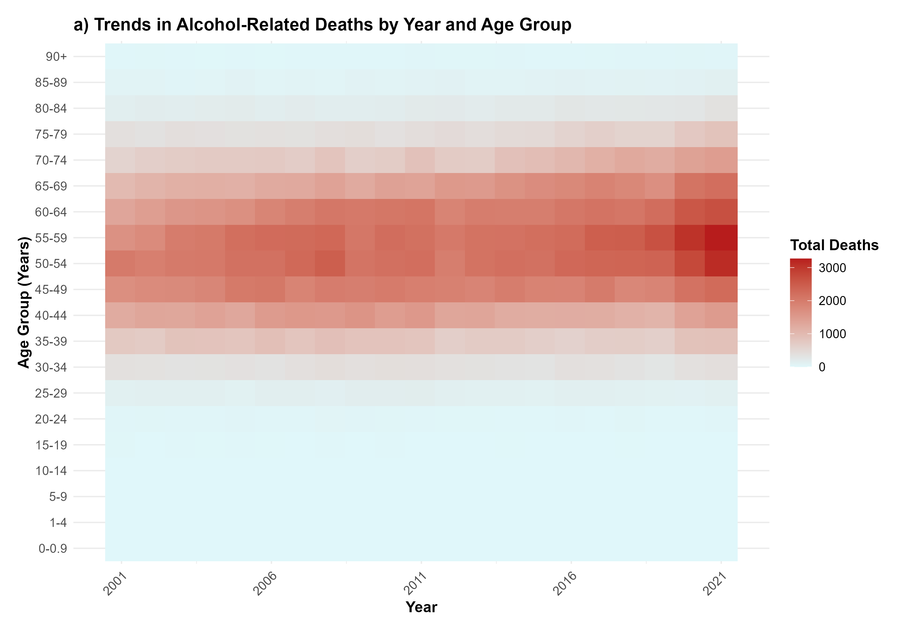

# **The Sobering Picture: Alcohol-Related Deaths in the UK 🍷📊**

## Overview
Alcohol-specific deaths are a growing public health issue in the United Kingdom. These deaths result from conditions directly caused by alcohol consumption, such as liver cirrhosis, alcohol poisoning, and alcoholic hepatitis. Understanding the patterns of these deaths is critical for tackling the significant social, economic, and healthcare challenges they create. This project uses clear, engaging visualizations to uncover how alcohol-specific deaths vary by age, sex, region, and time. The goal is to make these insights accessible to everyone, whether you're a policymaker, a healthcare provider, or simply someone who cares about public health.

## What This Project Shows
</iframe>

Our visualizations provide key insights into alcohol-specific deaths:
1. **Who is most affected**: Middle-aged males (40–69 years) are disproportionately impacted, making them the most vulnerable demographic.
2. **Where deaths are highest**: Scotland and northern England have the most alcohol-specific deaths, highlighting regional disparities.
3. **How trends have changed**: Deaths have steadily increased over the years, especially from 2015 onward, pointing to an escalating public health crisis.
4. **Differences between regions and sexes**: Males dominate in all regions, but Wales and Northern Ireland show significantly fewer deaths compared to Scotland and England.

These insights offer a comprehensive view of the issue, helping decision-makers prioritize interventions and allocate resources effectively.

## Why This Matters
Alcohol-specific deaths are preventable, and understanding the factors contributing to these fatalities is essential for saving lives. By highlighting trends and disparities, this project supports:
- **Targeted Health Campaigns**: Public health initiatives can be tailored to at-risk groups, such as middle-aged males in high-mortality regions.
- **Resource Allocation**: Policymakers can direct funding and resources to regions and populations most affected by alcohol-related harm.
- **Informed Policy Development**: Insights from the data can shape policies like minimum alcohol pricing and expanded addiction recovery programs.

Every life saved represents a win for individuals, families, and communities, reducing the broader societal burden of alcohol-related harm.

## Key Visualizations
### 1. **Heatmap**
- **What it shows**: Trends in alcohol-specific deaths across different age groups and years.
- **Key takeaway**: Middle-aged groups (40–69 years) consistently face the highest risk. Death rates have surged in recent years, especially from 2015 onward.
- **Why it matters**: This visualization reveals where interventions are needed most urgently, both in terms of age demographics and time periods.

### 2. **Geospatial Map**
- **What it shows**: Regional differences in alcohol-specific deaths for the baseline year of 2001.
- **Key takeaway**: Scotland stands out with the highest mortality rates, while Wales and Northern Ireland report significantly fewer deaths.
- **Why it matters**: The map highlights the geographic disparities in alcohol-related harm, supporting region-specific policy responses.
<iframe src="output/geospatial.html" width="800" height="600"></iframe>

### 3. **Scatter Plot**
- **What it shows**: Disparities in alcohol-specific deaths by age group and sex.
- **Key takeaway**: Males dominate across all age groups, with a sharp peak in the 50–59 age range. Females are consistently affected at lower rates.
- **Why it matters**: This visualization underscores the need for gender-specific health interventions and further research into the underlying causes of these disparities.

### 4. **Bubble Plot**
- **What it shows**: Regional and sex-based differences in alcohol-specific deaths.
- **Key takeaway**: England and Scotland dominate in terms of total deaths, with males disproportionately affected. Wales and Northern Ireland report the fewest deaths.
- **Why it matters**: The bubble plot visually combines regional and sex-based differences, providing a holistic view of where interventions should be focused.

## Accessible Insights for Everyone
We designed this project with accessibility in mind to ensure that its insights are clear and actionable for a broad audience:
- **Simple Visuals**: Each chart is designed to highlight key trends and disparities without overwhelming viewers with excessive detail.
- **Interactive Potential**: Future updates may include interactive features like clickable maps, hover-based tooltips, and zooming capabilities for deeper exploration.
- **Plain Language**: All explanations are straightforward and free of jargon, making the data meaningful for everyone.

By removing barriers to understanding, we aim to make this critical information accessible to policymakers, healthcare providers, and the general public.

## Why You Should Care
Alcohol-related harm doesn’t just affect individuals—it impacts entire families, communities, and economies. These insights can:
- Drive public health campaigns that save lives.
- Inform government decisions on funding and resources.
- Raise awareness of alcohol-related harm and its preventable nature.

Understanding these patterns isn’t just about statistics; it’s about real people and real change. Together, we can address this public health crisis and build a healthier future.

## How to Get Involved
- **Share This Information**: Spread awareness in your community by sharing these insights.
- **Support Policy Change**: Advocate for evidence-based policies, like minimum alcohol pricing or improved access to recovery programs.
- **Collaborate**: If you work in public health, research, or policymaking, contact us to explore how these insights can support your work.

