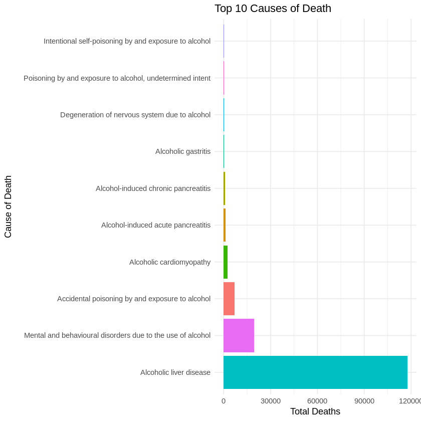

# Beyond the Bottle: Unveiling Alcohol Mortality Trends and Future Predictions 🍾🍺🔍

This project explores **alcohol-related mortality trends** and uncovers key insights into the factors driving these trends. Through engaging visualizations and data analysis, the aim is to highlight important patterns and provide valuable information to guide public health decisions.

---

## 📌 **What Is This Project About?**

This project looks at **alcohol-specific deaths** in the United Kingdom, answering these key questions:
1. **What are the trends in alcohol-related deaths over time?**
2. **Which age groups and regions are most affected?**
3. **What are the main causes of alcohol-related deaths?**
4. **Can we use data to predict future trends?**

---

## 🎨 **Visual Highlights**

### 1. **Top Causes of Death**
Alcoholic liver disease is the dominant cause, followed by mental and behavioral disorders due to alcohol.

### 2. **Trends Over Time**
Deaths have risen over the past two decades, with a sharp spike after 2015.

<iframe src="output/trends_by_region.html" width="600" height="400"></iframe>

---
## 🌟 **Key Findings**

### 1. **Leading Causes of Death**
- **Alcoholic Liver Disease**:
  - The dominant cause of alcohol-related deaths, contributing to **over 70% of all cases**.
  - This reflects the cumulative effect of long-term alcohol consumption, which severely damages the liver.
- **Mental and Behavioral Disorders Due to Alcohol**:
  - The second-most reported cause, though it accounts for far fewer deaths than liver disease.
  - These include disorders like alcohol dependency syndrome, highlighting the mental health toll of alcohol use.
- **Other Causes**:
  - "Accidental poisoning by alcohol" and "Alcoholic cardiomyopathy" contribute minimally but are still significant in some age groups.

---

### 2. **Age Groups Most at Risk**
- **Middle-aged individuals (ages 45–64)**:
  - The most affected demographic, with deaths sharply increasing in this age range.
  - Likely due to long-term alcohol abuse, leading to chronic health conditions such as liver failure or cardiovascular disease.
- **Younger Age Groups**:
  - Mortality rates are relatively low in individuals under 30, reflecting fewer long-term effects of alcohol consumption.
- **Elderly Population (70+)**:
  - Death rates decline compared to middle-aged groups, possibly due to survivor bias and reduced alcohol consumption in older age.

---

### 3. **Regional Disparities**
- **England**:
  - Contributes the **highest number of alcohol-specific deaths overall**, reflecting its larger population size.
  - The death rate shows consistent increases across all age groups since 2015.
- **Scotland**:
  - While the total number of deaths is lower than in England, **Scotland has the highest per-capita mortality rate**, indicating severe regional challenges.
- **Wales and Northern Ireland**:
  - These regions contribute fewer deaths overall but show unique trends, with certain causes and age groups disproportionately represented.

---

### 4. **Rising Trends Over Time**
- **Post-2015 Spike**:
  - Alcohol-specific deaths have shown a noticeable increase in the last decade, with rates sharply rising after 2015.
- **Wider Implications**:
  - These trends may reflect increasing alcohol consumption, reduced healthcare access, or delayed health interventions in high-risk populations.

---

## 💡 **Why Does This Matter?**

Understanding alcohol-specific mortality is crucial for:
- **🛠️ Policymakers**: Developing interventions for high-risk groups and regions.
- **⚕️ Healthcare Providers**: Prioritizing resources for leading causes of alcohol-related deaths.
- **📢 Public Awareness**: Educating individuals about the risks of alcohol consumption and its long-term impacts.

---

## 🛠️ **About the Project**
This project leverages **data science** to tackle an important public health issue:
- **Goal**: Use data to identify patterns and predict future trends in alcohol-specific mortality.
- **Tools**: Statistical analysis, machine learning, and impactful visualizations.
- **Impact**: The findings highlight critical areas for intervention and resource allocation.

---

## 🤝 **About Me**
I’m passionate about using data to address real-world problems. This project demonstrates my ability to:
- Clean and analyze complex datasets.
- Build predictive models to uncover key insights.
- Communicate findings effectively for both technical and non-technical audiences.

More info about the project: ([repo](https://github.com/Mahesh7667/Data-Driven-Insights-into-Alcohol-Related-Mortality/tree/main))
Feel free to reach out or explore the project further: 📧 [My Email](mailto:mahesh.k7667@gmail.com)

---

Thank you for visiting! I hope this project inspires meaningful discussions about public health and the power of data. 💻📊
