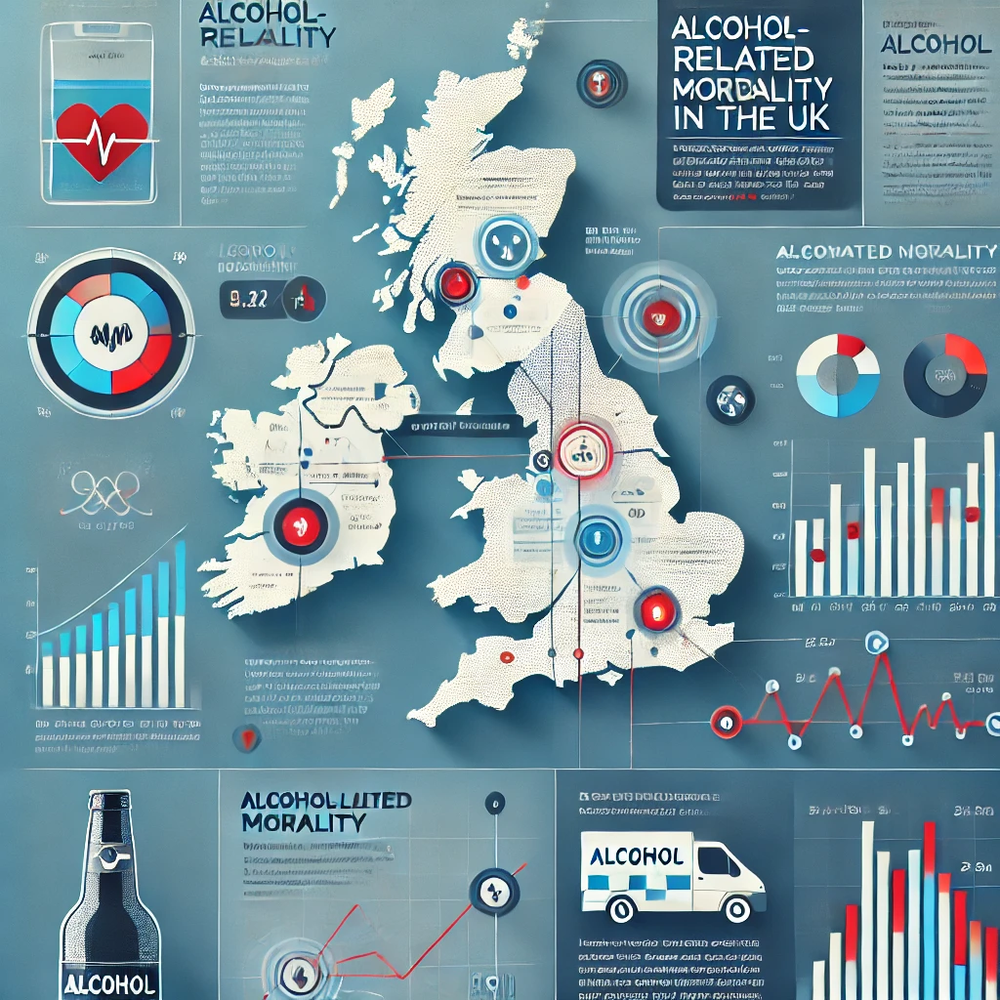
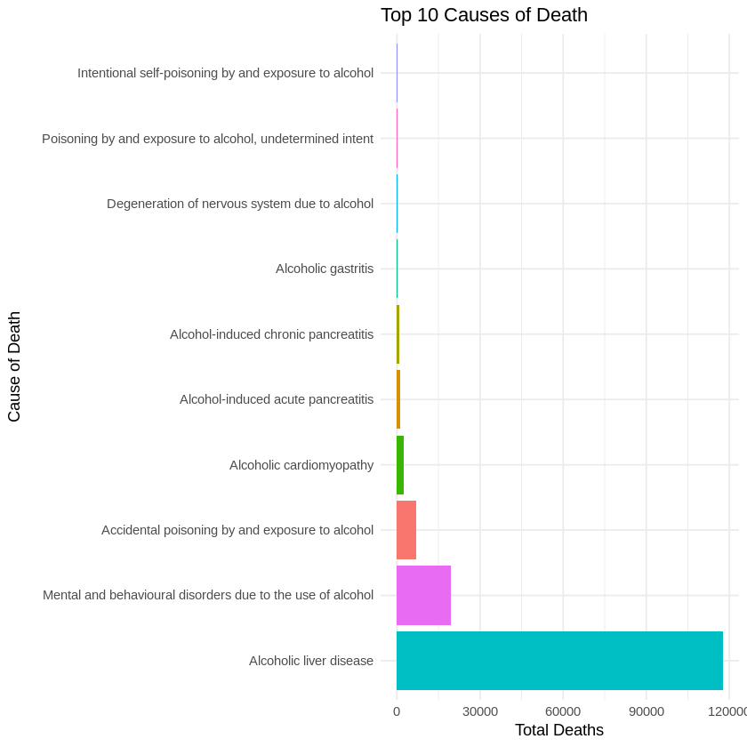

# Last Sip: Unveiling Alcohol Mortality Trends and Forecasts 🍾🍺🔍

<meta property="og:title" content="Last Sip"/>
<meta property="og:image" content="https://mahesh7667.github.io/Data-Driven-Insights-into-Alcohol-Related-Mortality/meta/last_sip.png"/>
<meta property="og:description" content="Last Sip: Unveiling Alcohol Mortality Trends and Forecasts"/>
<meta property="og:url" content="https://mahesh7667.github.io/Data-Driven-Insights-into-Alcohol-Related-Mortality/Trends-and-Future-Prediction"/>
<meta property="og:image:width" content="1200" />
<meta property="og:image:height" content="627"/>
<meta property="og:type" content="website"/> 

  <!-- Left column for text -->
  

    <h2>📢 A Public Health Crisis</h2>
    
Alcohol-specific deaths in the UK are rising at an alarming rate, particularly among middle-aged individuals (45-64 years). 
    The leading cause remains <b>alcoholic liver disease</b>, accounting for over 70% of alcohol-related fatalities. 
    This issue affects not just individuals but entire communities, straining healthcare systems and increasing societal costs.

    <h3>📊 Key Findings:</h3>
    - England and Scotland have the <b>highest mortality rates</b> 📈  
    - Deaths <b>peaked post-2015</b>, highlighting recent trends  
    - Liver disease dominates, with mental health issues also contributing  
    - Younger groups have <b>lower</b> mortality, but risks are increasing  
  

  <!-- Center image -->
  

    
    
<i>A data-driven visualization of alcohol-related deaths in the UK</i>

  

  <!-- Right column for text -->
  

    <h2>🚨 The Growing Concern</h2>
    
Despite government regulations and public awareness campaigns, alcohol-related deaths continue to rise.  
     
    <b>Why?</b> Factors such as affordability, accessibility, and cultural drinking norms all play a role. 
    With rising socioeconomic disparities, certain demographics remain disproportionately affected.

    <h3>💡 What’s Next?</h3>
    - Stronger <b>public health policies</b> are needed 📜  
    - More funding for <b>rehabilitation programs</b> 🏥  
    - Raising awareness through <b>education & outreach</b> 🎓  
    - Data-driven insights to inform <b>policy decisions</b> 📈  
  

 
This project explores **alcohol-related mortality trends** and uncovers key insights into the factors driving these trends. Through engaging visualizations and data analysis, the aim is to highlight important patterns and provide valuable information to guide public health decisions.

---

## 📌 **What Is This Project About?**

This project looks at **alcohol-specific deaths** in the United Kingdom, answering these key questions:
1. **What are the trends in alcohol-specific deaths over time?**  
2. **Which age groups and regions are most affected?**  
3. **What are the leading causes of alcohol-related deaths?**  
4. **How can we use data to predict future trends?**  

---

## 🎨 **Visual Highlights**

### 1. **Top Causes of Death**
Alcoholic liver disease is the dominant cause, followed by mental and behavioral disorders due to alcohol.

### 2. **Trends Over Time**
Deaths have risen over the past two decades, with a sharp spike after 2015.

<iframe src="output/trends_by_region.html" width="600" height="400"></iframe>

---
## 🌟 **Key Findings**

### 1. **Leading Causes of Death**
- **Alcoholic Liver Disease**:
  - The dominant cause of alcohol-related deaths, contributing to **over 70% of all cases**.
  - This reflects the cumulative effect of long-term alcohol consumption, which severely damages the liver.
- **Mental and Behavioral Disorders Due to Alcohol**:
  - The second-most reported cause, though it accounts for far fewer deaths than liver disease.
  - These include disorders like alcohol dependency syndrome, highlighting the mental health toll of alcohol use.
- **Other Causes**:
  - "Accidental poisoning by alcohol" and "Alcoholic cardiomyopathy" contribute minimally but are still significant in some age groups.

---

### 2. **Age Groups Most at Risk**
- **Middle-aged individuals (ages 45–64)**:
  - The most affected demographic, with deaths sharply increasing in this age range.
  - Likely due to long-term alcohol abuse, leading to chronic health conditions such as liver failure or cardiovascular disease.
- **Younger Age Groups**:
  - Mortality rates are relatively low in individuals under 30, reflecting fewer long-term effects of alcohol consumption.
- **Elderly Population (70+)**:
  - Death rates decline compared to middle-aged groups, possibly due to survivor bias and reduced alcohol consumption in older age.

  This finding underscores the need for targeted public health interventions focusing on middle-aged individuals, especially those in the 45–64 range. Early education and prevention programs in younger age groups can also help reduce future mortality.

---

### 3. **Regional Disparities**
- **England**:
  - Contributes the **highest number of alcohol-specific deaths overall**, reflecting its larger population size.
  - The death rate shows consistent increases across all age groups since 2015.
- **Scotland**:
  - While the total number of deaths is lower than in England, **Scotland has the highest per-capita mortality rate**, indicating severe regional challenges.
- **Wales and Northern Ireland**:
  - These regions contribute fewer deaths overall but show unique trends, with certain causes and age groups disproportionately represented.

  Regions like Scotland require **specific, localized interventions** to address the high per-capita mortality rate. England's large-scale challenges call for **nationwide efforts**, including stricter alcohol policies and improved healthcare access.

---

### 4. **Rising Trends Over Time**
- **Post-2015 Spike**:
  - Alcohol-specific deaths have shown a noticeable increase in the last decade, with rates sharply rising after 2015.
- **Wider Implications**:
  - These trends may reflect increasing alcohol consumption, reduced healthcare access, or delayed health interventions in high-risk populations.

  Public health policies must adapt to this rising trend by focusing on prevention, treatment access, and addressing societal factors (e.g., unemployment, stress) that contribute to higher alcohol consumption.

  Efforts to combat alcohol-related deaths should focus on **early detection and treatment of liver disease** and provide better support for those facing **mental health issues** linked to alcohol.

---

### **5. Predicting Future Trends**
Using data, we identified key predictors of alcohol-related mortality:
  - All ages total mortality is the most significant predictor.
  - Age group and region are also critical, highlighting demographic and geographic disparities.
  - Gender variable play a smaller role, contributing around 5% each.
  - The predictions struggles with extreme outliers, indicating the need for more granular or enriched datasets for improved predictions.
  
  
  Data-driven insights provide a foundation for **evidence-based policymaking**. Understanding the predictors of mortality allows public health officials to design targeted interventions, potentially saving lives.

---

## 💡 **Why Does This Matter?**

Understanding alcohol-specific mortality is crucial for:
- **🛠️ Policymakers**: Developing interventions for high-risk groups and regions.
- **⚕️ Healthcare Providers**: Prioritizing resources for leading causes of alcohol-related deaths.
- **📢 Public Awareness**: Educating individuals about the risks of alcohol consumption and its long-term impacts.

---

## 🛠️ **About the Project**
This project leverages **data science** to tackle an important public health issue:
- **Goal**: Use data to identify patterns and predict future trends in alcohol-specific mortality.
- **Tools**: Statistical analysis, machine learning, and impactful visualizations.
- **Impact**: The findings highlight critical areas for intervention and resource allocation.

---
### Another Interesting Read

🔗 [Exploring through Visualizations](https://mahesh7667.github.io/Data-Driven-Insights-into-Alcohol-Related-Mortality/Exploring-through-Visualizations)

---

## 🤝 **About Me**

I am a **data-driven problem solver** passionate about turning raw data into actionable insights. My expertise spans the entire data science pipeline, and this project showcases my ability to:

- **Clean and preprocess complex datasets** for meaningful analysis.  
- **Develop predictive models** using techniques to uncover patterns and trends.  
- **Visualize data effectively** to communicate findings clearly to both technical and non-technical audiences.  
- **Leverage tools and technologies** like R, Python to solve real-world problems.  

Through this project, I have explored large datasets, identifying critical patterns (e.g., alcohol-related mortality trends), and creating data-driven solutions to inform decision-making.

More info about the project: ([repo](https://github.com/Mahesh7667/Data-Driven-Insights-into-Alcohol-Related-Mortality/tree/main)) 
Feel free to reach out or explore the project further: 📧 [Email](mailto:mahesh.k7667@gmail.com), [Linkedin](https://www.linkedin.com/in/mahesh-kadireddy/)

---

Thank you for visiting! I hope this project inspires meaningful discussions about public health and the power of data. 💻📊
